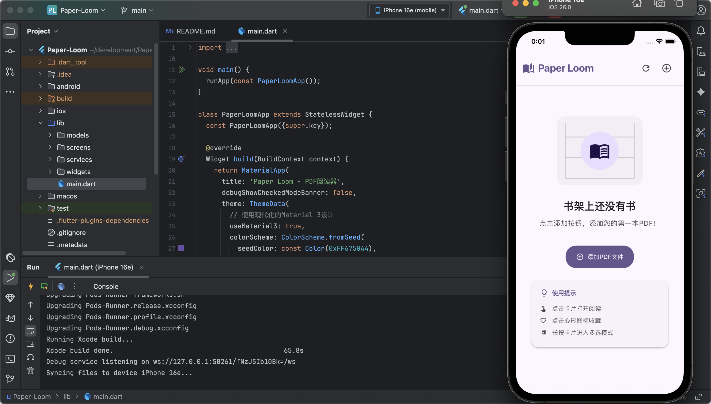

# paper_loom

Paper-Loom - 学術論文向けPDFリーダーの試作（開発初期段階） 、3つのAI機能を構想中：
```
>OCRによるPDF最適化・読みやすい形式への変換
>プロンプトベースのAI質問機能
>引用関係による論文推薦システム
```
技術構成：Flutter（フロントエンド試作）+ Python FastAPI（バックエンド予定）
タグ：#AI支援開発 #学術ツール #開発中 #Flutter #vibe-coding



## Getting Started

This project is a starting point for a Flutter application.

A few resources to get you started if this is your first Flutter project:

- [Lab: Write your first Flutter app](https://docs.flutter.dev/get-started/codelab)
- [Cookbook: Useful Flutter samples](https://docs.flutter.dev/cookbook)

For help getting started with Flutter development, view the
[online documentation](https://docs.flutter.dev/), which offers tutorials,
samples, guidance on mobile development, and a full API reference.
